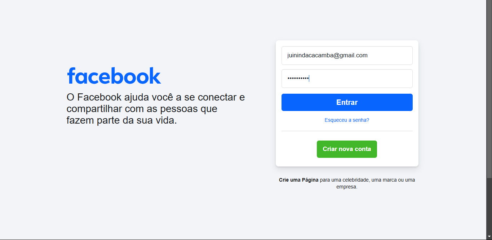
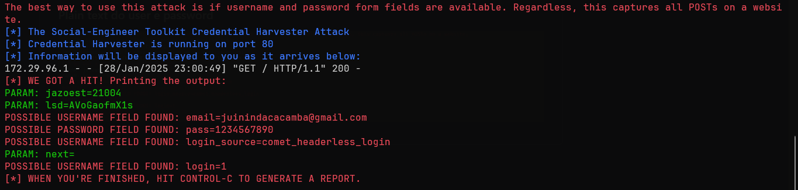

# Desafio da DIO: Criando um *phishing* no kali-linux

Aqui eu segui a risca o passo a passo do instrutor, mas conforme foi apontado pelo usuário **RLLKLLSS** nesse [repositório](https://github.com/RLLKLLSS/cibersecurity-desafio-phishing), alguns desses sites, como o facebook que foi o exemplo do instrutor, há um script de defesa que torna a solução conforme foi apontada no vídeo impossível.

Dessa forma, seguindo o passo a passo apontado pelo **RLLKLLSS** e, no kali-linux você deve:

1. Acessar o root do kali-linux
```bash
sudo su
```

2. Iniciar o setoolkit (caso já esteja instalado)
```bash
setoolkit
```

3. "Setar" o tipo de ataque para **"1) Social-Engeneering Attacks"**
```bash
1
```

4. "Setar" o vetor de ataque para **"2) Web Site Attack Vectors"**
```bash
2
```

5. "Setar" o método de ataque para **"3) Credential Harvester Attack Method"**
```bash
3
```

6. Para definir o método de ataque em si
   1. Caso o site não possua o tal script de defesa, pode "setar" o método de ataque como **"2) Site Cloner"** e, dessa forma, depois de fornecermos um IP pra ele hostear, vamos copiar a página (.html) pelo link.
    ```bash
    2
    ```
    ```bash
    192.0.0.1
    ```
    ```bash
    http://www.linkdosite.com
    ```
   2. Caso contrário, temos que "setar" como **"3) Custom Import"**, "setar" o IP pra ele poder hostear, prover a página (index.html) base (baixando aa página, copiando e substituindo o código-fonte e apagando o script de defesa do botão de login), nomear o link e deixar ele escutando.
    ```bash
    3
    ```
    ```bash
    192.0.0.1
    ```
    ```bash
    /path/to/dir/page
    ```
    ```bash
    http://www.linkdosite.com
    ```

## Resultado
Conforme requerido pelo desafio, eis o resultado do *phishing* criado:

- Site falso hosteado localmente.


- Console do Kali-Linux (WSL) com as credencias roubadas.

